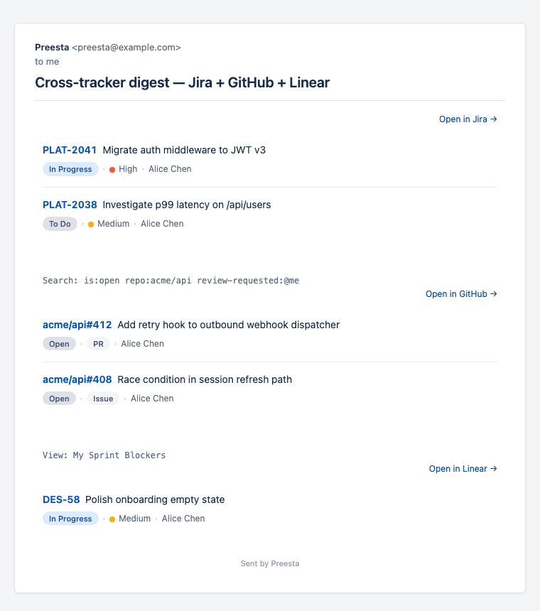

# Preesta

[](https://github.com/preesta/preesta/actions/workflows/dotnet.yml)
[](https://github.com/preesta/preesta/pkgs/container/preesta)
[](https://preesta.dev/)
[](LICENSE)
[](https://dotnet.microsoft.com/)

> Rule-based digests for your issue trackers.



Preesta is a small CLI tool that reads rules from a YAML file, queries one or more issue trackers (Jira, Linear, GitHub, GitLab, Shortcut), groups the matched issues by recipient, and ships each recipient a personal digest by email, Telegram, and Slack. It can also run write-side actions (comments, status changes, label flips) against the same matches.

**[Full documentation at preesta.dev →](https://preesta.dev/)**

## Quickstart (TL;DR)

```bash
mkdir preesta && cd preesta
# put secrets/appsettings.secrets.yaml (SMTP + tracker tokens) and rules.yaml here
docker run --rm \
  -v "$(pwd)/secrets:/app/secrets:ro" \
  -v "$(pwd)/rules.yaml:/app/rules.yaml:ro" \
  ghcr.io/preesta/preesta:latest preesta
```

The full walkthrough — token procurement per tracker, SMTP setup, first rule — is at **[preesta.dev/quickstart/](https://preesta.dev/quickstart/)**.

## Supported trackers

| Tracker | Docs |
|---|---|
| Jira (Server & Cloud) | [preesta.dev/trackers/jira/](https://preesta.dev/trackers/jira/) |
| Linear | [preesta.dev/trackers/linear/](https://preesta.dev/trackers/linear/) |
| GitHub (Issues + PRs) | [preesta.dev/trackers/github/](https://preesta.dev/trackers/github/) |
| GitLab | [preesta.dev/trackers/gitlab/](https://preesta.dev/trackers/gitlab/) |
| Shortcut | [preesta.dev/trackers/shortcut/](https://preesta.dev/trackers/shortcut/) |

## Delivery

Email (SMTP), Telegram personal DMs, Slack personal DMs — same digest content, three channels. Per-recipient routing via workspace-level email→ID maps.

## Mental model

A rule says *which issues, who to notify, what to do.* The "who to notify" part is decoupled from the rule itself — rules are impersonal, identity lives in markers (`assignee`, `reporter`) that resolve at dispatch time. One rule fans out into N digests, one per distinct assignee. See **[Impersonal rules](https://preesta.dev/concepts/obezlichennye-rules/)**.

## Origin

Preesta started in 2019 as "Bender". In 2026 it was rebuilt on .NET 8, gained YAML rules, Linear / GitHub / GitLab / Shortcut support, and was renamed.

## Contributing

Engineering walkthrough lives in [`dev-notes/contributing/adding-a-tracker.md`](dev-notes/contributing/adding-a-tracker.md). Tests run with `dotnet test` (~200 tests, all in-process).

## License

MIT — see [LICENSE](LICENSE).
