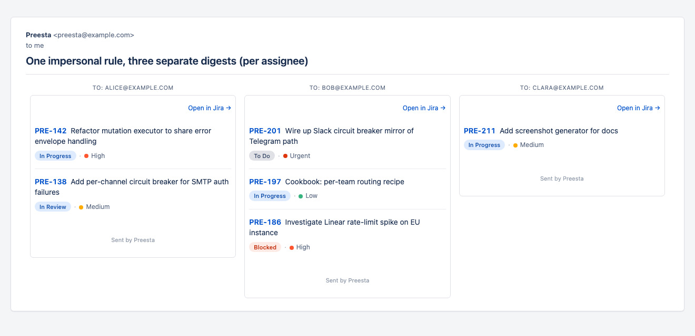

# Routing model

A single digest is built once and shipped via every configured channel. This page explains how the same `mailTo: assignee` marker translates into a Slack DM, a Telegram message, and an email.



## The two stages of routing

Stage 1 — **inside the rule** — turns markers into emails. Stage 2 — **inside the channel** — turns emails into the channel's native identifier.

```
                  ┌───── Stage 1: in IssueSupplier.GetPackages ─────┐
issue.Assignee ─▶ │ marker "assignee" → assignee.email              │
                  │ group packages by (To, Cc, Subject, Rule)       │
                  └─────────────────────────────────────────────────┘
                                          │
                                          ▼
                  ┌───── Stage 2: in MessageBuilder ────────────────┐
package.emails ─▶ │ Email channel: send directly via SMTP           │
                  │ Telegram:   lookup email → chatId in            │
                  │             rulesConfig.telegramUsers           │
                  │ Slack:      lookup email → SlackId in           │
                  │             rulesConfig.slackUsers              │
                  └─────────────────────────────────────────────────┘
```

The single source of truth is the issue's `Participants.{Assignee,Reporter,Creator}.Email`. Every channel resolves from there.

## Stage 1: markers → emails

Already covered in **[Impersonal rules](obezlichennye-rules.md#how-the-dispatch-works)**. The short version: `mailTo: assignee` produces one package per distinct `assignee.email`.

## Stage 2: emails → channel IDs

Telegram and Slack use their own user ID formats (`8640756719` / `U01ABCDEFG`) that Preesta can't infer from an email address. The user maps in `rules.yaml` close the gap:

```yaml
# rules.yaml — alongside the rules: list
telegramUsers:
  alice@example.com: "12345678"
  bob@example.com:   "987654321"

slackUsers:
  alice@example.com: U0AAA1111
  bob@example.com:   U0BBB2222
```

For each package, the channel-specific MessageBuilder walks the package's email list (`Addressees.To ∪ Addressees.Cc`) and looks each one up in the channel's map. Hits become DMs; misses are skipped silently.

So with `mailTo: assignee` and both maps populated, three issues across two assignees produce:

| Channel | Sends |
|---|---|
| Email | 2 messages (one to alice@, one to bob@) |
| Telegram | 2 DMs (12345678, 987654321) |
| Slack | 2 DMs (U0AAA1111, U0BBB2222) |

Each message has identical content rendered in the channel's native format (HTML, Telegram HTML, Slack mrkdwn). Same digest, three channels, two recipients per channel.

## Literal IDs on the rule

The `notify.telegramChatId` and `notify.slackUserId` fields on a rule take literal IDs (comma-separated) that go to *every* fired digest, every time, regardless of who else is in the recipient list:

```yaml
notify:
  mailTo: assignee
  telegramChatId: "999999999"   # always notified
  slackUserId: "U0OPS0OPS"      # always notified
```

That's the right pattern for "team lead always gets a copy" — same as a literal email in `cc`, just on the chat side. It's *not* a per-recipient pattern; for that, use the email markers + the workspace map.

## Recipient resolution path

The full path for one matched issue:

```
Issue.Participants.Assignee.Email = "alice@example.com"
         │
         ▼ (Stage 1)
notify.mailTo = "assignee" → resolves → "alice@example.com"
         │
         ▼ (group by resolved email)
Package(To = ["alice@example.com"], items = [issue1, issue2])
         │
         ▼ (Stage 2: per channel)
SMTP:      send to "alice@example.com"
Telegram:  rulesConfig.telegramUsers["alice@example.com"] = "12345678" → DM 12345678
Slack:     rulesConfig.slackUsers["alice@example.com"] = "U0AAA1111" → DM U0AAA1111
```

## When the assignee has no email

A few trackers don't always return a usable email:

- **GitHub** returns `""` for `User.email` if the user has hidden their email in profile settings. The User object stays (login + display name show in the digest body) but `Email=""`, so Stage 1 produces a package with `To: ""` which the Stage 2 channels skip cleanly.
- **GitLab** is the same — `User.publicEmail` is `null` for users who haven't exposed their email.
- **Shortcut** resolves owner UUIDs via a workspace-wide `/api/v3/members` fetch cached for the run; if the member lookup fails the owner becomes a User with empty email, same skip.

The principle is: an unresolvable recipient never breaks the digest. Other recipients still get their slice. The digest body for everyone else still mentions the issue (with the unresolvable user's display name, just not their email).

## Where the maps live

`telegramUsers:` and `slackUsers:` are workspace-level — defined once in `rules.yaml`, used by every rule. They're not per-rule because the email-to-ID mapping is a property of your organization, not of any particular digest.

See **[Telegram setup](../delivery/telegram.md)** and **[Slack setup](../delivery/slack.md)** for token + ID procurement.
