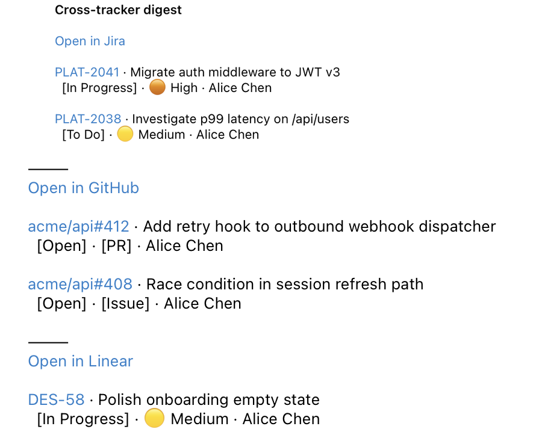
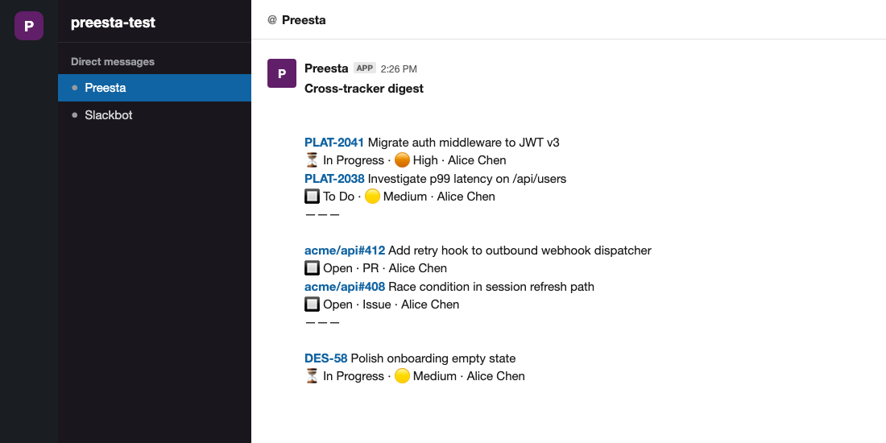

# Multi-tracker digest

**Goal:** one tag fires rules across Jira + Linear + GitHub, each producing one section in a single per-assignee digest. The result: a recipient who's active in all three trackers gets one email with three sections, each headed by an "Open in &lt;tracker&gt; →" link.


## How the merge happens

Packages are grouped by `(To, Cc, Subject)`. Use the same `subject:` across the three rules and a recipient with work in all three gets one email with three sections; use different subjects and they fan out into separate emails. Per-tracker "Open in &lt;tracker&gt; →" headers and tracker-specific chips keep each section identifiable inside the merged digest.

The Telegram and Slack DMs follow the same merge — the bot posts one combined message with the same `———` separator between sections:





## The rules.yaml

```yaml
rules:
  # Linear: in-flight sprint work
  - tracker: linear
    tags: morning-roundup
    filterRaw:
      and:
        - cycle: { isActive: { eq: true } }
        - state: { type: { neq: completed } }
    notify:
      subject: "Cross-tracker digest"
      mailTo: assignee
      columns: [Status, Priority, Updated]

  # Jira: assigned tickets with no resolution
  - tracker: jira
    tags: morning-roundup
    filter: "assignee in (membersOf('engineering')) AND resolution is EMPTY"
    notify:
      subject: "Cross-tracker digest"
      mailTo: assignee
      columns: [Status, Priority, DueDate]

  # GitHub: open issues and PRs across the org
  - tracker: github
    tags: morning-roundup
    filter: "is:open org:bigcorp"
    notify:
      subject: "Cross-tracker digest"
      mailTo: assignee
      columns: [Type, Status, Updated]
```

## Schedule

```cron
30 8 * * 1-5  /usr/bin/dotnet /opt/preesta/Preesta.dll morning-roundup
```

One CLI invocation, three tracker fetches in parallel (each pipeline runs as its own `Task`), one batch of merged per-assignee emails sent in one SMTP session.

## Verifying

Run with `Verbose` logging once to see all three pipelines firing:

```
INFO 4 rules with tracker=linear found for tags [morning-roundup]
INFO 2 rules with tracker=jql found for tags [morning-roundup]
INFO 1 rules with tracker=github found for tags [morning-roundup]
INFO Sent 6 email messages
```

The recipient list per email comes from the rule's own `mailTo` — alice can be Linear-only, bob can be Jira+GitHub. With a shared subject, packages bound for the same recipient merge into one email; with distinct subjects, they stay separate.

## Adding GitLab and Shortcut

Same pattern. Each tracker gets its own rule entry tagged `morning-roundup`. The tag is just a CLI selector — there's no upper bound on rules sharing a tag.

```yaml
  - tracker: gitlab
    tags: morning-roundup
    filter: { state: opened, assigneeUsernames: [...] }
    notify: { subject: "Cross-tracker digest", mailTo: assignee }

  - tracker: shortcut
    tags: morning-roundup
    filter: "!state:completed !is:archived owner:..."
    notify: { subject: "Cross-tracker digest", mailTo: assignee }
```
