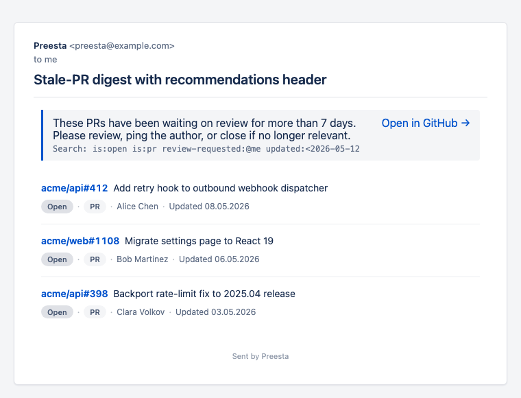
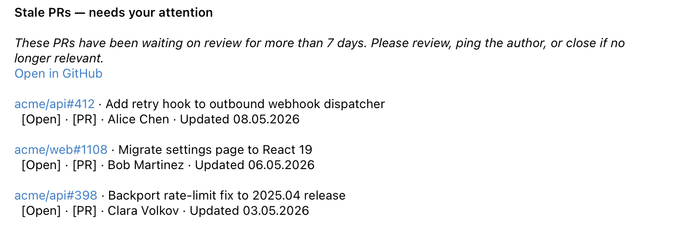
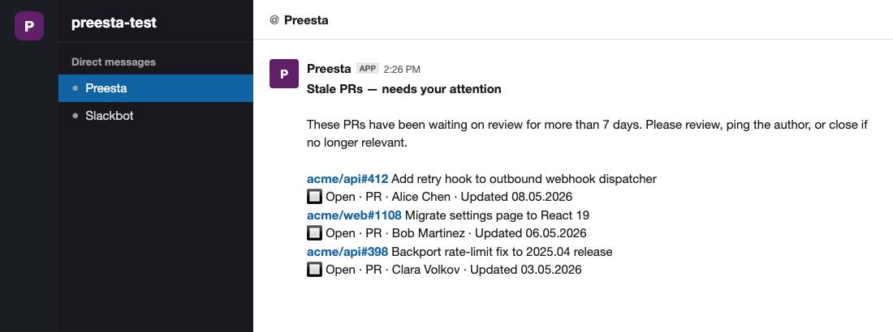

# Stale PRs / MRs

**Goal:** hourly during business hours, ping authors and reviewers of pull requests that haven't moved in 5+ days.



The same digest delivered to Telegram and Slack:





## GitHub flavour

```yaml
- type: github
  group: stale-prs
  filter: "is:open is:pr org:bigcorp review:required updated:<2026-05-01"
  notify:
    subject: "Stale PRs waiting on review"
    recommendations: "Bump or close. Reviews older than 5 days hurt cycle time."
    mailTo: reporter   # PR author
    cc: ""
    columns: [Type, Status, Updated, Labels]
```

`is:pr` (vs `is:issue`) narrows to pull requests only. `review:required` filters to PRs that have requested reviews. `updated:<DATE` is a rolling window — set it from your CI / cron template or just bump the date weekly.

## GitLab flavour

> GitLab MRs are not yet supported as a separate rule type — see the [GitLab tracker page](../trackers/gitlab.md#issues-only-no-mrs) for the deferred-feature note. Use a tracker-specific Slack alert via GitLab's native automations for now, or wait for the MR rule type.

## Shortcut flavour (PR-equivalent: stories awaiting review)

```yaml
- type: shortcut
  group: stale-prs
  filter: "state:\"Ready for Review\" updated:<-5d !is:archived"
  notify:
    subject: "Stories awaiting review"
    mailTo: reporter
    columns: [Type, Status, Updated]
```

`updated:<-5d` is Shortcut's "older than 5 days ago" shorthand.

## Linear flavour

Linear treats PRs as linked from the GitHub side, not first-class. The Linear-side digest is "issues that should be closed because their PR has merged but the issue is still Done":

```yaml
- type: linear
  group: stale-prs
  filterRaw:
    state:
      type:
        eq: completed
    completedAt:
      gte: P-7D
  notify:
    subject: "Recently completed Linear issues — verify scope"
    mailTo: assignee
```

## Schedule

```cron
0 9-17 * * 1-5  /usr/bin/dotnet /opt/preesta/Preesta.dll stale-prs
```

## Tuning

- **Too aggressive?** Move from hourly to twice-daily (`0 10,15`) — most teams don't need hourly poking on stale PRs.
- **Want a Slack reaction instead of email?** Add the `slackUsers:` map and pick a quieter delivery cadence — Slack DMs feel more urgent than email.
