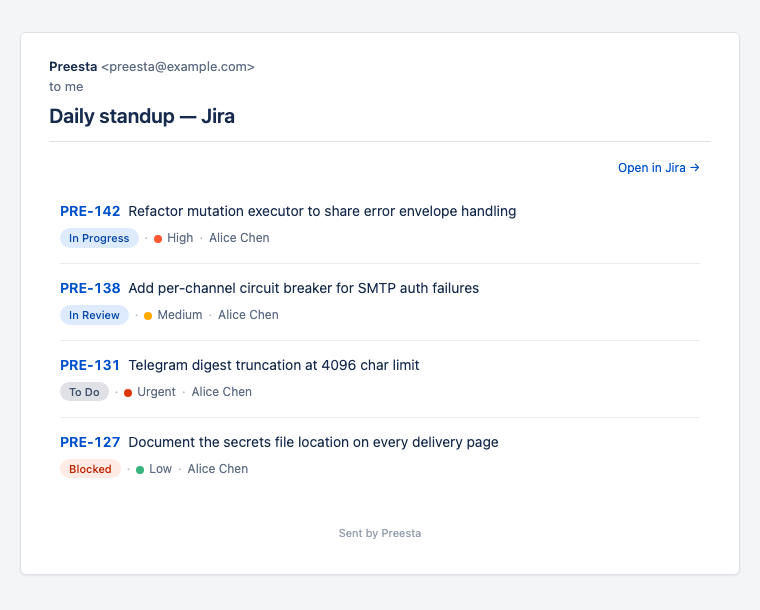

# Preesta

**Rule-based digests for your issue trackers.**

Preesta is a small CLI tool that reads rules from a YAML file, queries one or more issue trackers (Jira, Linear, GitHub, GitLab, Shortcut), groups the matched issues by recipient, and ships each recipient a digest by email, Telegram, and Slack. It can also run write-side actions (comments, status changes, label flips) against the same matches.

It exists because every issue tracker has its own notification preferences screen, every team has its own "what's stale, what's blocking, what's on me today" question, and none of those preference screens lets you answer *yours*. With Preesta you write the question once in a rule, schedule it with cron, and the digest lands in the inbox of the people who actually need to see it.

## Who is this for?

- Engineering managers who want a daily snapshot of blockers/stale tickets/overdue items across the team
- Teams running multiple trackers (Jira for releases, Linear for product, GitHub for code, …)
- Solo engineers tired of email noise from per-tracker notification settings
- Anyone who wants automated comments / status changes on tickets that match a written-down policy

## How it works (one sentence)

A `rules.yaml` file lists rules; each rule says *which tracker, which issues, who to notify, what to do.* Preesta runs once per cron tick, fetches the matches, groups them by recipient (e.g. one digest per `assignee`), and sends.

## What Preesta is *not*

Preesta is a thin scheduled layer **on top of** existing trackers. It deliberately doesn't try to be:

- **An incident-management platform.** No `Incident` object, no declare/ack/resolve lifecycle, no post-mortems. If you're paging an SRE at 3 a.m., reach for PagerDuty or Rootly, not Preesta.
- **An on-call / escalation engine.** No rotations, no "if no ack in 5 min then page the manager", no calendars. Per-recipient routing happens via the tracker's assignee, not via Preesta-owned schedules.
- **A workflow engine.** No transitions, approvals, branching runbooks, or multi-step orchestration. A rule's one optional mutation runs against each matched issue independently.
- **A status page / customer-comms tool.** Output is internal digests (email / Telegram / Slack DM) and tracker-side comments. Public status communication is somewhere else.
- **A tracker.** Issues live in Jira / Linear / GitHub / GitLab / Shortcut. Preesta queries them; it doesn't store them.

**The line that keeps the scope small:** Preesta is stateless across cron ticks. Every run starts from a clean slate, reads the current tracker state, dispatches, exits. If a feature would need Preesta to *remember* something between runs — escalation timers, SLA counters, who's been paged when — that feature lives elsewhere.

## What you read next

- **[Quickstart](quickstart.md)** — zero to first digest in 10 minutes.
- **[Concepts](concepts/architecture.md)** — the mental model in three pages.
- **[Trackers](trackers/index.md)** — per-tracker setup walkthroughs.
- **[Cookbook](cookbook/index.md)** — realistic rules you can copy.

## Supported trackers

| Tracker | Read (issues) | Write (mutations) |
|---|---|---|
| Jira (Server & Cloud) | JQL search | REST `callRest` |
| Linear | GraphQL `issues(filter:)`, AI prompt, saved views | GraphQL mutations |
| GitHub | GraphQL `search(type: ISSUE)` — issues + PRs | GraphQL mutations |
| GitLab | GraphQL `Query.issues` chip filter | GraphQL mutations |
| Shortcut | REST `/search/stories` | REST mutations |

## Delivery channels

Each digest is rendered once and dispatched on every channel that has credentials configured: HTML email through `Smtp:`, Telegram DM through `Telegram:botToken`, Slack DM through `Slack:botToken`. Configure the channels your team actually uses; Preesta needs at least one.
